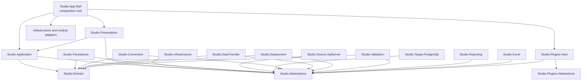
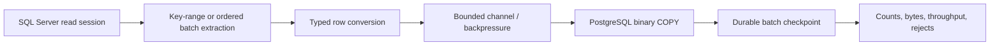

# SQL Server to PostgreSQL Migration Studio

## Architecture Specification

Status: **Approved baseline for implementation planning**
Target platform: **Windows, .NET 8, WPF**
Architecture style: **Modular monolith, Clean Architecture, ports and adapters, MVVM**

This document is the implementation boundary for the first release family. It deliberately contains no feature implementation or placeholder classes. Types named here are contracts, domain concepts, or ownership boundaries that later implementation must honor.

---

## 1. Architectural goals and constraints

The product migrates a complete SQL Server database, an explicitly selected subset, or an Excel-authored selection into PostgreSQL. It must support discovery, assessment, planning, conversion, data transfer, deployment, validation, reporting, recovery, and audit.

The important quality attributes are:

1. **Correctness over cleverness.** SQL conversion must be based on parsed syntax and resolved metadata, not regular-expression replacement.
2. **Determinism.** The same source snapshot, configuration, converter version, and plugin set must produce the same plan and generated artifacts.
3. **Recoverability.** Long-running work is journaled at stable checkpoints and can resume without silently duplicating data or skipping work.
4. **Auditability.** Every generated artifact, deployment action, validation result, warning, override, and plugin contribution is attributable to a run.
5. **Isolation of vendor concerns.** Npgsql, `Microsoft.Data.SqlClient`, ClosedXML, WPF, and parser libraries do not leak into the domain or application layers.
6. **Operability.** Cancellation, progress, structured logs, diagnostics bundles, bounded concurrency, and meaningful failure classification are built into contracts.
7. **Extensibility with control.** New rules, validators, report formats, and source/target capabilities can be added without allowing arbitrary plugins to corrupt core state.
8. **Testability.** Pure transformation logic is separated from database and UI effects. Provider behavior is tested against real database containers or managed instances.
9. **Security.** Secrets are never stored in project files, logs, reports, command text, or exception payloads.
10. **Desktop responsiveness.** No database, conversion, file, or report operation runs on the WPF dispatcher thread.

### Chosen system shape

A modular monolith is preferable to microservices for the desktop application because it has one operator, one workstation, one deployment unit, and many tightly coordinated local workflows. Internal modules have enforceable project boundaries and communicate through application contracts. Long-running engines are UI-agnostic and can later be hosted by a CLI, Windows service, or remote worker.

The application is organized around a durable **migration workspace**. A workspace contains configuration references, source inventory snapshots, an immutable migration plan revision, generated artifacts, execution journals, validation results, and reports. Secrets are referenced by credential IDs and stored outside the workspace.

---

## 2. Solution structure

```text
SqlServerToPostgreSqlMigrationStudio.sln
│
├─ src/
│  ├─ Studio.App.Wpf/
│  ├─ Studio.Presentation/
│  ├─ Studio.Application/
│  ├─ Studio.Domain/
│  ├─ Studio.Abstractions/
│  ├─ Studio.Infrastructure/
│  ├─ Studio.Persistence/
│  ├─ Studio.Source.SqlServer/
│  ├─ Studio.Target.PostgreSql/
│  ├─ Studio.Conversion/
│  ├─ Studio.DataTransfer/
│  ├─ Studio.Deployment/
│  ├─ Studio.Validation/
│  ├─ Studio.Reporting/
│  ├─ Studio.Excel/
│  ├─ Studio.Plugins.Abstractions/
│  └─ Studio.Plugins.Host/
│
├─ tests/
│  ├─ Studio.Architecture.Tests/
│  ├─ Studio.Domain.Tests/
│  ├─ Studio.Application.Tests/
│  ├─ Studio.Conversion.Tests/
│  ├─ Studio.DataTransfer.Tests/
│  ├─ Studio.Deployment.Tests/
│  ├─ Studio.Validation.Tests/
│  ├─ Studio.Reporting.Tests/
│  ├─ Studio.Excel.Tests/
│  ├─ Studio.Source.SqlServer.IntegrationTests/
│  ├─ Studio.Target.PostgreSql.IntegrationTests/
│  ├─ Studio.EndToEnd.Tests/
│  └─ Studio.App.Wpf.Tests/
│
├─ test-assets/
│  ├─ databases/
│  ├─ sql/
│  ├─ workbooks/
│  ├─ golden/
│  └─ plugins/
│
├─ build/
├─ docs/
│  ├─ decisions/
│  ├─ specifications/
│  └─ operations/
└─ Directory.Build.props
```

### Why these projects exist

| Project | Responsibility | Must not contain |
|---|---|---|
| `Studio.App.Wpf` | Composition root, Generic Host startup, WPF resources, windows, packaging | Business rules, SQL, migrations |
| `Studio.Presentation` | ViewModels, navigation, commands, UI state, presentation mapping | ADO.NET calls, conversion rules |
| `Studio.Application` | Use-case orchestration, commands/queries, workflow coordination, policies | WPF types, provider-specific types |
| `Studio.Domain` | Aggregates, value objects, invariants, domain events, execution state machine | I/O, DI, logging implementations |
| `Studio.Abstractions` | Stable application ports and cross-module result/progress contracts | Implementations or vendor types |
| `Studio.Infrastructure` | Clock, filesystem, credentials, hashing, compression, host diagnostics | Database-provider behavior |
| `Studio.Persistence` | Workspace repository, execution journal, cache, schema upgrades | Domain policy decisions |
| `Studio.Source.SqlServer` | SQL Server connectivity, metadata discovery, snapshot/read adapters, T-SQL parsing adapter | PostgreSQL deployment |
| `Studio.Target.PostgreSql` | PostgreSQL capabilities, identifier rules, DDL execution, COPY adapter, catalog reads | SQL Server discovery |
| `Studio.Conversion` | Intermediate representation, rule pipeline, type/expression/object conversion, SQL rendering | Live deployment or WPF |
| `Studio.DataTransfer` | Transfer planning, batching, transformations, backpressure, checkpoints | UI or direct credential storage |
| `Studio.Deployment` | Artifact packaging, dependency ordering, execution policy, rollback/compensation records | Conversion heuristics |
| `Studio.Validation` | Structural, data, semantic, and deployment validation orchestration | Report formatting |
| `Studio.Reporting` | Report document model, projections, renderers, templates | Migration decisions |
| `Studio.Excel` | Versioned workbook import/export through ClosedXML | Workflow orchestration |
| `Studio.Plugins.Abstractions` | Versioned, narrow plugin SDK contracts | Internal domain objects or DI container |
| `Studio.Plugins.Host` | Discovery, compatibility checks, loading, isolation, contribution registration | Core conversion rules |

This is intentionally more granular than a four-project Clean Architecture template. Conversion and data transfer will become large and have different performance and testing needs. Their separation prevents them from becoming a single unmaintainable “services” assembly.

---

## 3. Project and folder structure

Projects use folders by capability, not generic buckets such as `Helpers` or `Managers`.

```text
Studio.Application/
├─ Workspaces/
│  ├─ Create/
│  ├─ Open/
│  ├─ Upgrade/
│  └─ Close/
├─ Connections/
│  ├─ TestSource/
│  └─ TestTarget/
├─ Inventory/
│  ├─ Discover/
│  ├─ Compare/
│  └─ Select/
├─ Planning/
│  ├─ Build/
│  ├─ Assess/
│  ├─ Revise/
│  └─ Approve/
├─ Execution/
│  ├─ Run/
│  ├─ Pause/
│  ├─ Resume/
│  ├─ Cancel/
│  └─ Recovery/
├─ Validation/
├─ Reports/
└─ Common/
   ├─ Behaviors/
   ├─ Policies/
   └─ Mapping/
```

Each use-case folder contains its request, result, validator, and handler only when those types carry real behavior or an explicit boundary. There is no one-file-per-empty-abstraction rule.

Engine projects use the following shape:

```text
Studio.Conversion/
├─ Analysis/             # source semantic analysis and symbol resolution
├─ IntermediateModel/    # vendor-neutral semantic representation
├─ Planning/             # rule selection and conversion decisions
├─ Rules/
│  ├─ Types/
│  ├─ Identifiers/
│  ├─ Expressions/
│  ├─ Tables/
│  ├─ Constraints/
│  ├─ Indexes/
│  ├─ Views/
│  ├─ Routines/
│  └─ Triggers/
├─ PostgreSqlAst/
├─ Rendering/
├─ Diagnostics/
└─ Extensibility/
```

Test projects mirror production capability folders. Test names state behavior and expected outcome rather than implementation method.

### Repository rules

- Nullable reference types, implicit usings, analyzers, deterministic builds, and warnings-as-errors are configured centrally.
- Public APIs require XML documentation; internal code should be self-explanatory.
- Namespace equals project plus capability path.
- `Common`, `Shared`, and `Utility` may only contain concepts with a named owner and at least two genuine consumers. They are not dumping grounds.
- Architecture tests reject forbidden references and provider-type leakage.
- Database scripts and report templates are embedded or content-addressed assets with explicit versions.

---

## 4. Dependency diagram



### Enforced dependency rules

- `Domain` references no other solution project.
- `Abstractions` references only `Domain` where domain vocabulary is required.
- `Application` depends only on `Domain` and `Abstractions`.
- Adapters implement ports from `Abstractions`; adapters never reference `Presentation`.
- `Presentation` never references provider, persistence, engine, ClosedXML, Npgsql, or SqlClient assemblies.
- `App.Wpf` is the only production composition root and may reference concrete modules solely to register them.
- Modules do not resolve services from a global container. Dependencies are constructor-injected.
- Cross-engine coordination belongs to `Application`, not engine-to-engine references.

These rules prevent circular coupling while allowing the application layer to compose a complete migration workflow.

---

## 5. Domain model

The domain model records intent and facts; it does not mirror database catalog rows.

### Aggregates

| Aggregate | Purpose and invariant |
|---|---|
| `MigrationWorkspace` | Root of user-owned project state. Has one current plan revision and references all run history. A workspace ID never changes. |
| `SourceInventory` | Immutable, versioned snapshot of discovered source objects and capabilities. Every object has a stable source identity and dependency set. |
| `MigrationPlan` | Immutable approved intent: scope, mappings, object decisions, transfer policies, deployment order, and validation policy. Execution always references an exact plan revision. |
| `MigrationRun` | State machine for one execution attempt. Transitions are validated and journaled. A terminal run cannot return to an active state. |
| `ArtifactSet` | Content-addressed generated SQL and metadata tied to plan, engine, and plugin versions. Published artifacts are immutable. |
| `ValidationRun` | Validation policy, observations, findings, and final disposition for a specific migration run. |
| `ReportSnapshot` | Immutable projection of facts used to reproduce an issued report. |

### Entities

- `DatabaseObject`: source identity, qualified name, kind, parent, definition fingerprint, dependency identities, selection state.
- `SchemaMapping`, `TableMapping`, `ColumnMapping`: explicit source-to-target mapping and conversion decisions.
- `ConversionDecision`: rule ID/version, input fingerprint, outcome, diagnostics, optional approved override.
- `MigrationTask`: unit in the execution dependency graph with retry and checkpoint policy.
- `ExecutionAttempt`: start/end, worker, result classification, checkpoint reference, metrics.
- `ValidationCheck` and `ValidationFinding`: check identity, evidence, severity, disposition.
- `DeploymentUnit`: ordered artifact group and transaction policy.

### Value objects

- `WorkspaceId`, `PlanRevision`, `RunId`, `ObjectId`, `ArtifactId`, and `PluginId` are strongly typed.
- `DatabaseName`, `SchemaName`, `QualifiedObjectName`, and `SqlIdentifier` retain original spelling and quotedness.
- `SourceFingerprint` and `ContentHash` use an algorithm-tagged representation.
- `DatabaseConnectionReference` contains endpoint metadata and a credential reference, never a password.
- `SelectionScope` represents full database, schema set, table set, or workbook selection.
- `TypeDescriptor` represents logical type, length/precision/scale, nullability, collation, and vendor facets.
- `TransferPolicy` defines batch size bounds, concurrency, consistency mode, error policy, and large-object strategy.
- `DeploymentPolicy` defines dry-run, transaction boundaries, conflict behavior, timeouts, and advisory locking.
- `ValidationPolicy` defines required checks, tolerances, sampling, checksum strategy, and severity thresholds.
- `Diagnostic`: stable code, severity, message template, object location, evidence, and remediation.
- `ProgressSnapshot`: phase, completed/total work units, throughput, elapsed time, and optional current object.

### State machines

`MigrationRun` transitions:

```text
Created → Preparing → Running ⇄ Pausing → Paused → Resuming → Running
                         ├→ Cancelling → Cancelled
                         ├→ Failed
                         └→ Completed
```

Deployment and transfer tasks have their own states: `Pending`, `Ready`, `Running`, `Succeeded`, `Skipped`, `Failed`, `Compensated`. A task becomes `Ready` only when all required predecessors succeed.

Domain events are in-process facts such as `PlanApproved`, `RunStarted`, `TaskCheckpointed`, and `RunCompleted`. They update durable projections through application orchestration; they are not a claim that the desktop product requires an external message broker.

---

## 6. Service interfaces

Interfaces are defined at the boundary that consumes them. All I/O methods are asynchronous, accept `CancellationToken`, return structured results, and avoid provider-specific connection, command, reader, exception, and transaction types.

### Workspace and platform ports

| Interface | Essential operations |
|---|---|
| `IWorkspaceRepository` | Create/open workspace, load/save aggregate revision, optimistic concurrency check, upgrade storage schema |
| `IExecutionJournal` | Begin run/task attempt, append checkpoint/event, read recovery state, finalize attempt |
| `IArtifactStore` | Write content-addressed artifact, open verified content, enumerate manifest, publish immutable set |
| `ICredentialStore` | Store, retrieve, rotate, and remove secret by opaque credential reference |
| `IFileSystem` | Narrow workspace-safe file operations and atomic replace |
| `IClock` | UTC time and elapsed-time source for deterministic tests |
| `IHashService` | Streaming, algorithm-versioned content hashing |

### Database capability ports

| Interface | Essential operations |
|---|---|
| `ISourceConnectionService` | Test connectivity, server identity, permissions, and supported SQL Server capabilities |
| `ITargetConnectionService` | Test connectivity, PostgreSQL identity, permissions, extensions, and capabilities |
| `ISourceInventoryReader` | Stream schemas and objects, definitions, dependencies, types, row estimates, and source fingerprints |
| `ISourceDataReader` | Open a consistent read session and stream typed row batches from a planned extraction |
| `ITargetCatalogReader` | Read target objects, dependencies, row facts, sequence values, and definition fingerprints |
| `ITargetBulkWriter` | Start table load, write typed batches, complete/abort load, return accepted/rejected metrics |
| `ITargetCommandExecutor` | Execute deployment units under an explicit transaction and timeout policy |
| `IDatabaseExceptionClassifier` | Convert provider exceptions into stable transient/permanent/auth/permission/conflict categories |

### Engine ports

| Interface | Essential operations |
|---|---|
| `IInventoryService` | Discover an immutable source snapshot and emit discovery diagnostics |
| `IPlanBuilder` | Resolve selection, mappings, dependencies, policies, and produce a reviewable plan revision |
| `IAssessmentEngine` | Analyze plan feasibility and produce blockers, warnings, effort, and required overrides |
| `IConversionEngine` | Convert approved objects into target artifacts plus traceable decisions and diagnostics |
| `IDataMigrationEngine` | Execute the transfer graph with bounded concurrency and durable checkpoints |
| `IDeploymentEngine` | Validate, order, execute, and journal deployment units |
| `IValidationEngine` | Execute a validation policy and produce evidence-bearing findings |
| `IReportEngine` | Build a report snapshot and render it through a selected renderer |
| `IWorkbookImportService` | Parse a versioned workbook into an import proposal with cell-addressed issues |
| `IWorkbookExportService` | Export inventory, plan, issues, or report data using a declared workbook schema version |

### Orchestration and UI-facing ports

| Interface | Essential operations |
|---|---|
| `IMigrationWorkflow` | Prepare, start, pause, resume, cancel, and recover a run |
| `IProgressStream` | Publish and observe throttled immutable progress snapshots by operation ID |
| `IOperationRegistry` | Track active operations, cancellation ownership, and terminal results |
| `IUserInteraction` | Request confirmations, file choices, and credential prompts without placing dialogs in ViewModels |
| `INavigationService` | Navigate to typed route, back/forward, close workspace, restore navigation state |
| `INotificationService` | Present non-blocking user notices from application outcomes |

### Contract conventions

- Queries return immutable snapshots, not tracked entities.
- Streaming data uses `IAsyncEnumerable<T>` or an owned async session that must be disposed.
- Expected problems return a discriminated result with stable error codes. Exceptions are reserved for invariant violations, cancellation, or unexpected infrastructure failure.
- Progress is observation, not control. Cancellation and pause use explicit operation commands.
- Retry belongs at an idempotent boundary and is driven by classified failures. No blanket retry policy is permitted.

---

## 7. MVVM design

`Studio.Presentation` uses strict MVVM with an application-service boundary.

### Responsibilities

- **Views** own layout, visual states, accessibility, focus, and WPF-only behavior.
- **ViewModels** own presentation state, command availability, input validation summaries, and mapping application results to screen state.
- **Application handlers/workflows** own use cases, database access coordination, and business decisions.
- **Domain objects** never raise WPF events and are never directly bound to editable controls.

### ViewModel hierarchy

```text
ShellViewModel
├─ WorkspaceHeaderViewModel
├─ NavigationViewModel
├─ ActiveContentViewModel
└─ OperationCenterViewModel

WorkspaceViewModel
├─ DashboardViewModel
├─ ConnectionsViewModel
├─ DiscoveryViewModel
├─ SelectionViewModel
├─ AssessmentViewModel
├─ MappingViewModel
├─ ConversionViewModel
├─ DataMigrationViewModel
├─ DeploymentViewModel
├─ ValidationViewModel
├─ ReportsViewModel
└─ RunHistoryViewModel
```

Supporting ViewModels are real presentation concepts: `ObjectTreeViewModel`, `DiagnosticListViewModel`, `ExecutionGraphViewModel`, `ProgressViewModel`, `ArtifactPreviewViewModel`, and `ValidationFindingViewModel`.

### ViewModel rules

- A screen ViewModel is transient unless it intentionally holds workspace-scoped UI state.
- Long operations expose busy state, cancel/pause commands where valid, progress, and a terminal result.
- Commands prevent reentrancy and propagate cancellation.
- UI collections are updated on the dispatcher through one `IUiDispatcher` abstraction. Engines never depend on it.
- High-volume grids use paging or virtualization and immutable row projections; entire catalogs or logs are not materialized into observable collections.
- Validation uses presentation-specific input objects. Domain aggregates are changed only by application commands.
- ViewModels do not locate services, open dialogs, read configuration globals, or catch-and-ignore exceptions.
- Designer data is isolated in design-time factories, not runtime ViewModels.

The presentation layer may use a proven MVVM library, but its types remain confined to `Presentation` and `App.Wpf`. This avoids making domain and application contracts dependent on a UI framework.

---

## 8. Dependency injection design

The WPF application uses the .NET Generic Host and `Microsoft.Extensions.DependencyInjection`.

### Composition

1. `App.Wpf` creates the host and configuration sources.
2. Each module exposes one explicit registration entry point, such as `AddSqlServerSource`, `AddPostgreSqlTarget`, or `AddConversionEngine`.
3. Core registrations are completed before plugins are discovered.
4. Plugin contributions are validated and added through a restricted registry, not handed the root service collection.
5. The host starts before the shell and stops after active operations receive cancellation and journals flush.

### Lifetimes

| Lifetime | Usage |
|---|---|
| Singleton | Stateless rule catalogs, clocks, credential store, navigation coordinator, plugin catalog, process diagnostics |
| Workspace scope | Workspace repository session, active plan context, artifact store, operation registry |
| Operation scope | Discovery, conversion, transfer, deployment, validation, or report run and its scoped journal/metrics |
| Transient | ViewModels, use-case handlers, validators, renderers that hold no external resource |

ADO.NET connections, commands, readers, transactions, and COPY writers are never registered in DI. They are short-lived resources created by provider session factories and disposed at the operation boundary.

### DI validation

- Container validation runs at startup in development and in a dedicated architecture test for production registrations.
- Constructor cycles, service-locator access, optional service dependencies, and captive scoped dependencies are rejected.
- Options use typed, validated options objects. Secret values are resolved lazily through `ICredentialStore`.
- Named strategies are selected through typed registries keyed by stable IDs, not `IEnumerable<T>` scans spread through business code.

---

## 9. Navigation design

Navigation is route-based and workspace-aware.

`AppRoute` is a typed value identifying a screen and safe parameters such as workspace ID, run ID, or object ID. It never contains a View instance. `INavigationService` resolves route metadata to a ViewModel through registered route descriptors; WPF data templates select the View.

### Navigation regions

- Shell: application-level home, recent workspaces, settings, plugin management, help.
- Workspace: ordered migration workflow and run history.
- Inspector: contextual object, diagnostic, mapping, or artifact detail.
- Operation center: global active and recent long-running operations.

### Rules

- Route guards prevent entering execution screens without prerequisites such as an approved plan.
- Unsaved editable proposals participate in a navigation-away guard.
- Back/forward history stores typed routes, not ViewModels.
- Last safe route is persisted per workspace and restored only after workspace validation.
- Deep links from diagnostics navigate to the owning object and location.
- Modal dialogs are reserved for blocking credential entry, destructive confirmations, and OS file pickers. Multi-step work remains navigable content.

This design avoids coupling screens to each other and allows future CLI or alternative UI hosts to reuse application workflows.

---

## 10. Conversion engine architecture

Conversion is a compiler pipeline, not a text rewrite pipeline.

```mermaid
flowchart LR
    Definition["T-SQL definition + catalog metadata"] --> Parse["T-SQL parser adapter"]
    Parse --> SourceAst["Source AST with locations"]
    SourceAst --> Bind["Symbol binding and semantic analysis"]
    Bind --> IR["Vendor-neutral semantic IR"]
    IR --> Rules["Ordered conversion rules"]
    Rules --> TargetAst["PostgreSQL AST"]
    TargetAst --> Validate["AST and capability validation"]
    Validate --> Render["Deterministic renderer"]
    Render --> Artifact["SQL artifact + source map + diagnostics"]
```



### Stages

1. **Parse:** A supported T-SQL parser produces a loss-aware source AST with token positions. Unsupported syntax becomes a diagnostic, never silently disappearing text.
2. **Bind:** Names are resolved against the immutable `SourceInventory`; dependencies, aliases, scopes, inferred types, and built-in meanings are attached.
3. **Normalize:** Semantically equivalent SQL Server constructs become a vendor-neutral intermediate representation (IR).
4. **Plan rules:** Applicable rules are selected by object kind, server version, target version, configuration, and plugin compatibility.
5. **Transform:** Small ordered rules produce PostgreSQL AST nodes and explicit `ConversionDecision` records.
6. **Validate:** The target AST is checked for unresolved symbols, invalid identifiers, missing dependencies, and unsupported capability requirements.
7. **Render:** A deterministic formatter emits PostgreSQL SQL, source maps, dependency metadata, and an artifact hash.

### Rule contract

A conversion rule has a stable ID, semantic version, supported input node kinds, priority, capability predicates, and a pure transformation contract. Its output contains the transformed node, diagnostics, newly required dependencies/extensions, and trace evidence. Rules cannot perform database or filesystem I/O.

Rules are grouped by:

- identifier and schema mapping;
- data type and default conversion;
- expressions and built-in functions;
- tables, identity/sequence strategy, constraints, and indexes;
- views and materialized views;
- stored procedures/functions translated to PL/pgSQL where semantically safe;
- triggers;
- security and ownership;
- unsupported/manual-review classification.

### Correctness policies

- Identifier casing and quoting are handled centrally.
- Type conversion considers actual column facets and usage, not type name alone.
- Dynamic SQL is preserved as an explicit manual-review unit unless a dedicated parser proves it convertible.
- Behavioral differences—empty strings, collations, date arithmetic, null ordering, identity behavior, transaction semantics, exception handling—produce diagnostics or policy decisions.
- Generated SQL carries no source secrets or raw sample values.
- A manual override is a versioned plan decision with author, rationale, scope, and invalidation fingerprint.
- Golden tests assert AST/IR and normalized SQL; formatting-only changes do not conceal semantic regressions.

---

## 11. Data migration architecture

The data path is a bounded, asynchronous pipeline:



### Planning

The planner chooses a strategy per table from metadata and policy:

- stable primary/unique key range partitioning when available;
- ordered single stream for tables without a safe partition key;
- optional snapshot isolation for a consistent source view, after verifying database configuration and permissions;
- explicit large object and spatial/binary strategies;
- column transforms derived from the approved mapping;
- dependency-aware load ordering and deferred target constraint/index creation where policy permits.

### Execution

- SQL Server rows are read sequentially with provider-native async APIs.
- Values remain typed; culture-sensitive string round-tripping is prohibited.
- PostgreSQL uses Npgsql binary COPY when a safe binary mapping exists and text COPY only when required.
- Bounded channels enforce backpressure and cap memory.
- Concurrency is controlled globally and per source/target connection budget. Large tables cannot starve small tasks.
- Batch size adapts within policy bounds using observed latency, memory, and target behavior.
- Progress uses committed rows, not merely extracted rows.

### Recovery and consistency

A checkpoint contains the table mapping fingerprint, extraction boundary, committed target row count, batch hash where enabled, and target load generation. It is written only after target commit succeeds.

Resume is allowed only when plan, table definition, mapping, source fingerprint policy, and target load generation are compatible. Otherwise the task requires restart or an explicit operator decision. The engine never claims exactly-once delivery across two databases; it achieves safe replay through deterministic boundaries, staging/generation markers, and idempotent completion policies.

For a destructive “reload table” policy, the exact table is resolved and recorded before target mutation. The UI must show the target and consequence. Partial-row rejection is off by default because it can create a superficially successful but incomplete migration; when enabled, rejects go to a bounded, redacted error artifact and force a non-success disposition.

After load, identity-backed PostgreSQL sequences are advanced from validated target values. Constraints and indexes are enabled or created according to the deployment graph, followed by `ANALYZE` when policy requests it.

---

## 12. Deployment engine architecture

Deployment consumes an immutable `ArtifactSet`; it does not invoke conversion rules.

### Deployment phases

1. Preflight target identity, version, permissions, required extensions, database emptiness/conflict policy, and free-space signals.
2. Acquire a workspace/run-specific PostgreSQL advisory lock.
3. Create or validate a migration history schema and record the artifact manifest.
4. Build a dependency DAG and stable topological order.
5. Execute deployment units under their declared transaction policy.
6. Record artifact hash, SQL state, timing, rows affected where meaningful, and sanitized failure evidence.
7. Run post-deployment actions such as sequence alignment, constraint validation, and analyze.
8. Release the advisory lock and finalize disposition.

### Transaction policy

PostgreSQL transactional DDL is used where supported, but not all operations belong in one database-wide transaction. Units declare `Required`, `RequiresNew`, or `NonTransactional`; the planner rejects an invalid combination. A failed unit rolls back its own transaction. Previously committed units are not described as “rolled back”; their compensation or redeployment status is explicit.

Artifacts are idempotent only when their semantics genuinely allow it. Blind `IF EXISTS`/`IF NOT EXISTS` wrappers are not used to hide drift. Existing target objects are fingerprinted and processed under a selected policy: fail, adopt if equivalent, replace, or explicitly skip.

### Dry run

Dry run performs preflight, dependency planning, SQL parse/prepare checks where safe, conflict analysis, and a deployment preview without mutation. It produces a report and does not create false execution history.

---

## 13. Validation engine architecture

Validation is policy-driven and evidence-based. Checks declare required capabilities, cost, supported object types, prerequisites, and whether they mutate temporary state.

### Validation layers

1. **Inventory validation:** source snapshot completeness, unsupported/encrypted objects, unresolved dependencies.
2. **Plan validation:** mapping completeness, collision detection, unsafe narrowing, excluded required dependencies.
3. **Artifact validation:** SQL parseability, target capability requirements, unresolved references, deterministic hash verification.
4. **Structural validation:** target schemas, columns, types, nullability, defaults, constraints, indexes, routines, and dependencies.
5. **Data validation:** committed counts, null counts, min/max and aggregates, chunked checksums, key-set comparison, and deterministic samples.
6. **Behavioral validation:** opt-in query pairs or business assertions with canonical result comparison.
7. **Operational validation:** invalid constraints/indexes, unadvanced sequences, uncompiled routines, permission issues, and deployment history consistency.

### Data comparison

Canonicalization is type-aware and versioned. It specifies time zone handling, decimal normalization, floating-point tolerance, Unicode normalization, binary hashing, JSON normalization, and null representation. Checksums are computed over stable key ranges and canonical column encodings; concatenating formatted strings is not acceptable.

Every finding includes stable code, severity, source and target scope, expected/actual evidence, tolerance, check version, timestamp, and remediation. Suppression requires a recorded rationale and does not erase the finding.

A run can be `Passed`, `PassedWithWarnings`, `Failed`, or `Inconclusive`. Inconclusive is used when evidence is insufficient; it is never reported as passed.

---

## 14. Report engine architecture

Reporting is separated into facts, document composition, and rendering.

```text
Domain/run facts
   → report projection
   → immutable ReportSnapshot
   → renderer-neutral ReportDocument
   → XLSX / HTML / JSON renderer
```

### Report document model

`ReportDocument` contains metadata, sections, paragraphs, tables, metrics, findings, object links, and artifact references. It does not contain ClosedXML objects or HTML fragments. Each renderer owns pagination, styling, hyperlinks, charts, and format limitations.

### Standard reports

- assessment and compatibility;
- selected scope and mapping;
- conversion decisions and manual actions;
- execution summary and performance;
- deployment manifest and outcome;
- validation evidence and reconciliation;
- exceptions/rejected rows summary;
- audit report containing versions, hashes, plugins, policies, overrides, and timestamps.

The XLSX renderer uses ClosedXML behind `IReportRenderer`. Large detail sets are streamed or split into predictable sheets within Excel limits. Workbook sheet names, table names, formulas, and cell limits are validated centrally. HTML is the accessible human-readable format; JSON is the stable machine-readable exchange format. PDF can later render from the report document without changing engine facts.

Report generation reads immutable snapshots so a report cannot mix facts from different run states. Templates have schema versions and branding is a renderer concern.

---

## 15. Excel-driven migration architecture

Excel is an interchange and planning surface, not an alternate domain model.

Each workbook contains a hidden/locked manifest with workbook schema version, workspace/source inventory fingerprint, export time, and column contract versions. User-editable sheets cover scope, schema mappings, table/column mappings, policies, and approved overrides.

Import has three stages:

1. Parse cells into raw workbook records without changing workspace state.
2. Validate structure, types, enumerations, duplicates, stale fingerprints, object existence, mappings, and cross-sheet references.
3. Produce an `ImportProposal` showing additions, changes, removals, warnings, and cell-addressed errors. The user approves it before a new plan revision is created.

Unknown required columns fail import; unknown optional columns are preserved or warned according to workbook version policy. Formulas are not trusted as authoritative configuration values. Macros and external links are rejected. ClosedXML remains entirely inside `Studio.Excel`.

---

## 16. Logging and observability architecture

The code logs through `Microsoft.Extensions.Logging`; a structured provider writes local rolling files and an in-memory UI sink. Provider choice is a composition concern.

### Event shape

Every event can carry:

- application/version and machine-safe session ID;
- workspace ID, plan revision, run ID, operation ID, task ID;
- source/target object IDs, never secrets;
- stable event ID and category;
- duration, rows, bytes, throughput, retry count;
- exception classification and sanitized SQL state/provider code.

### Rules

- Message templates are stable and structured; interpolated secret-bearing strings are prohibited.
- Connection strings, passwords, access tokens, raw row values, and unredacted SQL parameters are never logged.
- Generated SQL is referenced by artifact ID and hash. Optional SQL diagnostics use a separately protected, user-enabled artifact.
- A redaction pipeline processes exceptions and provider messages before all sinks.
- High-frequency row/batch events become metrics or sampled debug events, not normal log volume.
- Correlation flows through async operations using an operation context, not thread-local state.
- The UI log view reads a bounded projection and does not tail the file directly.
- A support bundle includes redacted logs, configuration schema, version inventory, run manifest, and diagnostics; inclusion is previewable.

OpenTelemetry-compatible activities and metrics are used internally so future enterprise exporters can be added, but external telemetry is opt-in.

---

## 17. Plugin architecture

Plugins extend declared points; they do not replace core orchestration.

### Initial extension points

- conversion rule packs;
- custom type mappings and canonicalizers;
- assessment rules;
- validation checks;
- report renderers and report sections;
- workbook policy validators;
- target capability descriptors.

Source and target provider plugins are deferred until the contracts have proven stable because those plugins have much larger security and lifecycle surfaces.

### Package and manifest

A plugin package contains a manifest, assemblies, optional assets, and signature metadata. The manifest declares plugin ID/version, publisher, SDK compatibility range, application compatibility range, entry assembly, capabilities, dependencies, permissions, and content hashes.

### Host behavior

- Discover only from configured plugin directories.
- Validate manifest, hashes, duplicate IDs, dependency graph, compatibility, and trust policy before loading.
- Load each plugin into a collectible `AssemblyLoadContext` with controlled dependency resolution.
- Expose only `Studio.Plugins.Abstractions`; internal domain/application assemblies are not plugin API.
- Give plugins immutable DTOs and narrow contribution registries. Do not expose the root DI container, raw credentials, arbitrary database sessions, workspace repository, or UI dispatcher.
- Record plugin ID/version/hash in plan and artifact provenance.
- Disable a failing contribution for the current operation, produce a diagnostic, and fail when the contribution was required.

`AssemblyLoadContext` is dependency isolation, not a security sandbox. The first release accepts only trusted, signed in-process plugins. If untrusted third-party plugins become a requirement, they move to a separately permissioned process with a versioned RPC protocol, resource limits, timeouts, and kill/restart semantics.

---

## 18. Unit test architecture

Unit tests are deterministic, parallel-safe, and do not require network, filesystem outside a test sandbox, or installed databases.

### Test distribution

- `Domain.Tests`: aggregate invariants, state transitions, value equality, plan revision behavior.
- `Application.Tests`: handler orchestration, policy enforcement, cancellation, failure mapping, optimistic concurrency.
- `Conversion.Tests`: parser-to-IR fixtures, symbol binding, individual rules, rule ordering, diagnostics, source maps, deterministic rendering.
- `DataTransfer.Tests`: partition planning, backpressure, checkpoint compatibility, retry classification, typed conversions.
- `Deployment.Tests`: DAG ordering, cycle diagnostics, transaction grouping, conflict policies, recovery decisions.
- `Validation.Tests`: canonicalization, tolerance, checksum partitioning, dispositions.
- `Reporting.Tests`: document projections and renderer-neutral structure.
- `Excel.Tests`: workbook schema validation, stale imports, cell-addressed diagnostics, formula/external-link rejection.
- `Presentation.Tests`: command state, navigation guards, operation state, dispatcher handoff.

### Techniques

- Prefer hand-written fakes for behavior-rich ports and small substitutes for leaf dependencies.
- Use fixed clocks, deterministic IDs, seeded data generators, and invariant culture.
- Property-based tests cover identifier quoting, decimal/type boundaries, key partitioning, canonical encodings, and rule idempotence.
- Mutation testing targets conversion and validation rules.
- Golden files are reviewed assets. Tests compare normalized AST/IR plus output text so accidental golden-file approval cannot mask a semantic change.
- Performance microbenchmarks are separate from correctness tests and establish budgets for parsing, rendering, canonicalization, and row conversion.

`Studio.Architecture.Tests` uses assembly inspection to enforce the dependency rules in section 4, forbid provider references in inner layers, and verify plugin SDK compatibility constraints.

---

## 19. Integration and end-to-end test architecture

Integration tests use real supported SQL Server and PostgreSQL versions. Mocks cannot validate catalogs, SQL dialects, transaction behavior, COPY encoding, collations, permissions, or provider failure modes.

### Test matrix

- Minimum and current supported SQL Server versions/compatibility levels.
- Minimum and current supported PostgreSQL major versions.
- Windows authentication and SQL authentication where CI infrastructure permits.
- Representative collations, Unicode, time zones, decimal boundaries, binary/large values, identity columns, generated/default values, partitioned tables, constraints, indexes, views, routines, triggers, and failure cases.

### Layers

1. **Provider integration:** catalog discovery, definitions, typed reads, COPY writes, exception classification.
2. **Engine integration:** convert/deploy/validate fixture databases with real providers.
3. **End-to-end:** create workspace, discover, plan, convert, transfer, deploy, validate, and report.
4. **Recovery:** terminate at controlled failpoints, reopen workspace, validate journal, resume, and compare final state.
5. **Upgrade:** open workspaces created by previous released schema versions and verify non-destructive migration.
6. **WPF smoke/accessibility:** startup, major navigation, command wiring, high-DPI themes, keyboard flow, and automation properties.

Containers are preferred in CI where licensing and runner capabilities permit; externally managed test instances are supported through protected CI configuration. Each test owns uniquely named databases/schemas and performs verified scoped cleanup. Destructive cleanup never uses an unresolved or shared target.

Fixture databases and expected artifacts are versioned in `test-assets`. Flaky retries are not used to conceal nondeterminism. Slow suites are categorized and run on pull request, nightly, and release gates according to cost.

Release qualification includes performance scenarios with large row counts and wide tables, memory ceilings, cancellation latency, recovery correctness, and report size limits.

---

## 20. Persistence, configuration, and security

### Workspace storage

A workspace is a directory package with:

- a small human-readable manifest;
- a transactional embedded catalog for aggregates, projections, journals, and schema version;
- content-addressed artifact and report directories;
- atomic temporary area scoped to the workspace.

An embedded relational catalog is justified because run journals, object inventories, dependency queries, optimistic concurrency, and upgrades exceed what is safely manageable as a collection of mutable JSON files. The concrete embedded database is an infrastructure decision recorded in an ADR before implementation.

Workspace writes use transactions plus atomic file replacement. A single-writer workspace lease prevents two application instances from modifying the same workspace. Read-only recovery mode remains possible after corruption or an unsupported future schema is detected.

### Configuration

Precedence is: application defaults → machine policy → user settings → workspace policy → run overrides. Every effective run records the non-secret configuration snapshot. Policies use validated, versioned schemas.

### Secrets

Credentials are stored using Windows-protected credential facilities behind `ICredentialStore`. Workspace and report files contain only opaque references. Passwords have the shortest possible lifetime in memory and are never represented by normal configuration logging. Connection tests report permissions without exposing sensitive server responses.

### Application updates

Workspace schema and plugin SDK versions evolve independently from the application version. Upgrades are forward-only, backed up, transactional where possible, and recorded. A newer workspace is never silently downgraded.

---

## 21. Failure handling and operational behavior

Failures are classified as:

- validation/precondition;
- authentication/authorization;
- transient connectivity/resource;
- target conflict/drift;
- source changed/stale plan;
- unsupported conversion;
- data conversion/rejection;
- cancellation;
- internal defect.

Each category has an explicit retry, user-action, and reporting policy. Retries use bounded exponential backoff with jitter only for classified transient, idempotent operations. Deployment statements of unknown commit status are reconciled against deployment history and target catalog before retry.

Pause is cooperative and occurs only at declared safe points. Cancel stops new work, drains or aborts active provider operations, records final checkpoint state, and leaves the workspace recoverable. Application shutdown uses the same operation protocol and never simply abandons journal writes.

Unhandled UI exceptions, background task exceptions, and host shutdown failures go through one fatal-error coordinator that attempts a diagnostics flush and offers safe restart/recovery. Continuing after an unknown invariant violation is not permitted.

---

## 22. Future extensibility

The architecture deliberately leaves these seams:

- A CLI or Windows service can host `Application` and the engines without referencing WPF.
- Remote workers can later implement operation ports using a versioned protocol; checkpoint and artifact contracts are already host-neutral.
- Additional report renderers consume `ReportDocument`.
- Additional validation packs register checks through stable IDs.
- New SQL Server/PostgreSQL versions contribute capability descriptors and rule predicates instead of scattered version checks.
- A future migration-plan collaboration server can synchronize immutable plan revisions and artifacts.
- Localization is isolated to presentation and report resource resolution; stable diagnostic codes remain invariant.
- Enterprise authentication, centralized policy, external secrets, and OpenTelemetry exporters fit infrastructure ports.
- Untrusted plugins can move out of process without changing rule/check semantic contracts.
- Additional source or target database families require new provider capability contracts and probably a generalized product identity; they must not be forced into today’s SQL Server/PostgreSQL-specific interfaces prematurely.

### Versioning rules

- Persisted workspace schemas, workbook schemas, report JSON, plugin SDK, diagnostic codes, and artifact manifests each have independent semantic or schema versions.
- Public compatibility is promised only for explicitly documented contracts.
- Conversion rules record their own versions because application version alone is insufficient to reproduce output.
- Deprecated contracts receive a defined support window and upgrade diagnostics.

---

## 23. Architecture decision records required before feature implementation

The following ADRs must be accepted before their affected implementation begins:

1. Embedded workspace database and migration mechanism.
2. T-SQL parser selection, license, supported SQL Server grammar levels, and loss behavior.
3. PostgreSQL AST/rendering implementation strategy.
4. Structured logging provider, retention, and support-bundle policy.
5. MVVM library and WPF control suite.
6. Plugin signing/trust policy and SDK compatibility rules.
7. Installer, application update, and code-signing mechanism.
8. Supported SQL Server/PostgreSQL version matrix.
9. Consistent-read and resume guarantees presented to users.
10. Report formats, accessibility baseline, and retention policy.

These are decisions with material compatibility, licensing, or operational consequences. Deferring them into incidental implementation would create expensive rework.

---

## 24. Implementation sequencing gate

Architecture completion does not authorize feature implementation. The next phase should produce ADRs, domain vocabulary, contract review, threat model, failure-mode analysis, and one walking-skeleton plan. The walking skeleton should prove composition, workspace persistence, operation journaling, cancellation, and diagnostics with a non-migration operation before database features are built.

Feature implementation should then proceed in vertical increments:

1. workspace and connection foundations;
2. inventory and selection;
3. plan/assessment and Excel interchange;
4. conversion by object families;
5. artifact generation and deployment;
6. data transfer and recovery;
7. validation;
8. reporting and release hardening.

No stage may bypass the immutable plan, artifact provenance, operation scope, or execution journal. Those are the product’s reliability spine, not optional infrastructure.
