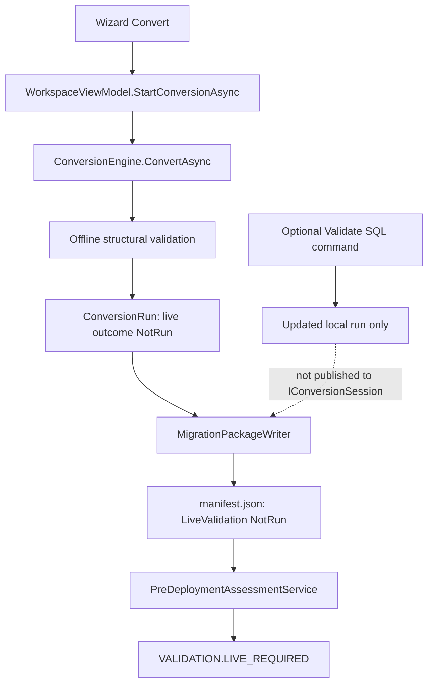
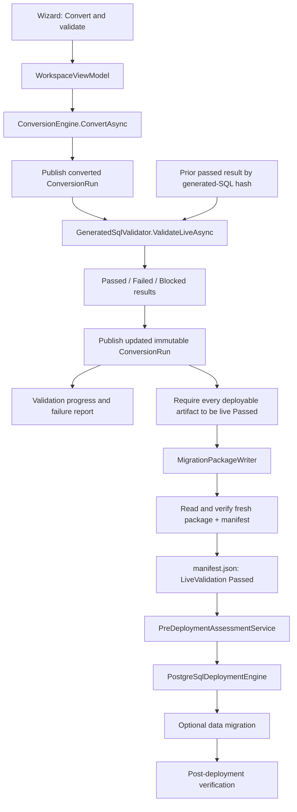

# Live PostgreSQL validation workflow

## Root cause

The deployment gate was operating correctly. The desktop workflow produced the
wrong package state:

1. `WorkspaceViewModel.StartConversionAsync` ran `ConversionEngine.ConvertAsync`.
   The engine calls `IGeneratedSqlValidator.ValidateOfflineAsync`, so each
   artifact received structural validation only. Its live outcome remained
   `NotRun`.
2. The same command immediately passed that offline-only `ConversionRun` to
   `MigrationPackageWriter`.
3. `MigrationPackageWriter` correctly copied `ConversionArtifact.Validation`
   into `PackageArtifactManifest.LiveValidation`.
4. Live validation was available only as a separate advanced-workspace command.
   It built an updated local `ConversionRun`, but did not publish that run back
   to `IConversionSession`.
5. The simplified wizard invoked conversion/package generation but never invoked
   live validation. Deployment subsequently created `DeploymentOptions` with
   `RequireLivePostgreSqlValidation = true`, and
   `PreDeploymentAssessmentService` correctly emitted
   `VALIDATION.LIVE_REQUIRED`.

The first state-loss point was therefore the desktop live-validation command:
the updated artifact results reached the view but not the shared conversion
session used by later package operations. The earlier package-generation order
also guaranteed that the manifest was written before those results existed.

## Previous execution and error flow

## Corrected execution flow

## State and safety rules

- Conversion never publishes a deployment package.
- Live validation updates every artifact in a new immutable `ConversionRun` and
  publishes it through the existing `IConversionSession`.
- Package generation is allowed only when every executable, non-manual,
  supported artifact has `WasLiveValidated = true`, `Outcome = Passed`, and
  `IsStructurallyValid = true`.
- A freshly written package is read and verified before its path is exposed to
  the UI. The manifest is checked a second time for the same live-validation
  invariants.
- Editing generated SQL recomputes its SHA-256 content hash, resets its
  validation to `NotRun`, and clears the exposed package path. An executable
  artifact remains executable; the edit does not silently move it into the
  non-deployed manual-review set.
- Revalidation reuses only passed, structurally valid, genuinely live results
  whose generated-SQL hash is unchanged. Changed artifacts and the dependency
  closure needed to construct their isolated validation environment are
  executed. A failed, blocked, cancelled, offline-only, or hash-mismatched
  result is never reused.
- Manual-review and unsupported artifacts remain report-only and do not cause a
  PostgreSQL connection when all executable artifacts are reusable.
- Cancellation does not publish a package.
- PostgreSQL credentials and connection strings are not included in progress,
  failure rows, reports, or manifest validation results.

## UI behavior

The advanced workspace exposes the validation connection, **Validate SQL**,
validation progress, completed/total counts, current object, a failure table,
generated SQL, and validation-report export. It exposes package generation and
export as explicitly validated operations.

The simplified wizard's Convert step now performs conversion, synchronizes the
tested PostgreSQL target as the validation target, runs live validation,
publishes the updated run, and generates the verified package. It cannot mark
the step complete unless a verified package path is returned.

Failure rows include object name, script, PostgreSQL message, SQLSTATE, derived
line number, blocking dependency, generated SQL, and a suggested correction.
After editing failed SQL, the unchanged successful results are reused and only
the changed artifact/dependency closure is revalidated; full reconversion is not
required.

## Deployment option and gate locations

- `WorkspaceViewModel.CreateDeploymentRequest` creates `DeploymentOptions` and
  explicitly enables `RequireLivePostgreSqlValidation`.
- `PreDeploymentAssessmentService.ValidateManifest` enforces
  `VALIDATION.LIVE_REQUIRED` for selected deployable executable artifacts.
- `PostgreSqlDeploymentEngine` performs assessment before execution and deploys
  only non-manual, supported executable artifacts.

No production code disables or bypasses these checks.

## Modified files

- `src/MigrationStudio.Application/Conversion/ConversionContracts.cs`
- `src/MigrationStudio.Validation/GeneratedSqlValidator.cs`
- `src/MigrationStudio.Desktop/ViewModels/ConversionArtifactViewModel.cs`
- `src/MigrationStudio.Desktop/ViewModels/WorkspaceViewModel.cs`
- `src/MigrationStudio.Desktop/ViewModels/MigrationWizardViewModel.cs`
- `src/MigrationStudio.Desktop/Views/WorkspaceView.xaml`
- `src/MigrationStudio.Desktop/Views/MigrationWizardView.xaml`
- `tests/MigrationStudio.Tests/Desktop/ConversionResultBindingTests.cs`
- `tests/MigrationStudio.Tests/Desktop/MigrationWizardViewTests.cs`
- `tests/MigrationStudio.Tests/Deployment/DeploymentPackageAndRecoveryTests.cs`
- `tests/MigrationStudio.Tests/Integration/PostgreSqlDeploymentIntegrationTests.cs`
- `tests/MigrationStudio.Tests/Validation/GeneratedSqlValidatorReuseTests.cs`

## Verification

The unit and WPF smoke suites verify package manifest propagation, validation
cache safety, edit invalidation, and wizard validation/progress bindings. The
PostgreSQL integration deployment test now performs live validation, writes the
updated run into a package, requires live validation during assessment, deploys
the package, and verifies the resulting PostgreSQL objects. It runs when
`MIGRATIONSTUDIO_POSTGRES_INTEGRATION` is configured.
